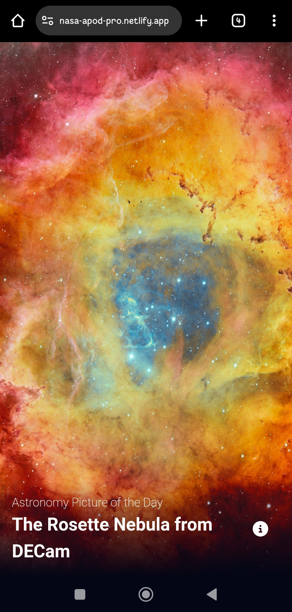
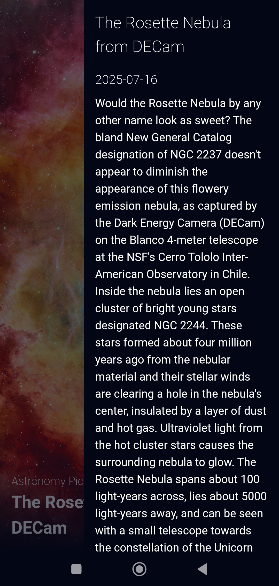

## 📍 Astronomy Picture of the Day

🔭 Este proyecto es una aplicación web que muestra la "Astronomy Picture of the Day" (APOD) utilizando la API oficial de la NASA. 

🤓 Permite a los usuarios visualizar la imagen astronómica destacada del día junto con su descripción, título y otros datos relevantes. 

✔ La aplicación almacena en caché la información diaria para optimizar el rendimiento y ofrece una interfaz moderna, responsiva y fácil de usar. Es ideal para quienes desean explorar y aprender sobre el universo a través de imágenes seleccionadas por la NASA.

📌 Puedes ver el proyecto desde este <a href="https://nasa-apod-pro.netlify.app">enlace</a>

### 🛠 Tecnologías utilizadas

- React.js
- CSS3
- HTML5
- API de la NASA (APOD)
- Netlify

### 📷 Imágenes del proyecto

